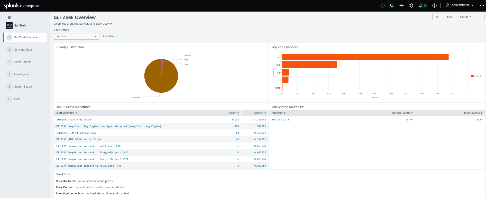
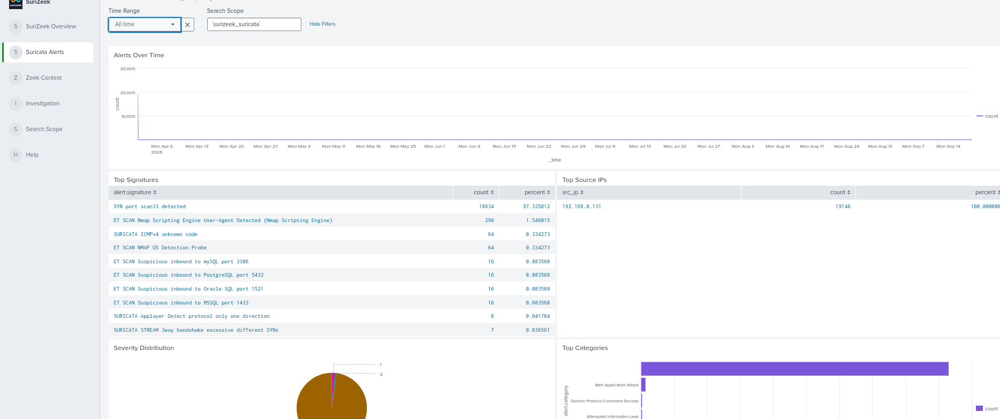
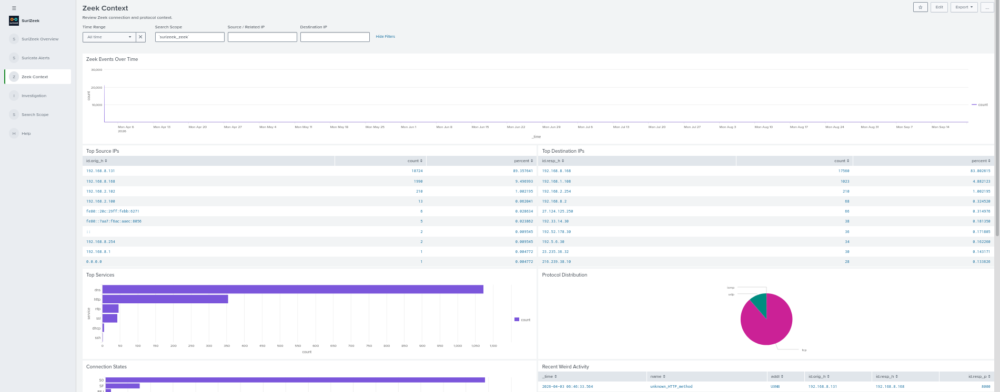
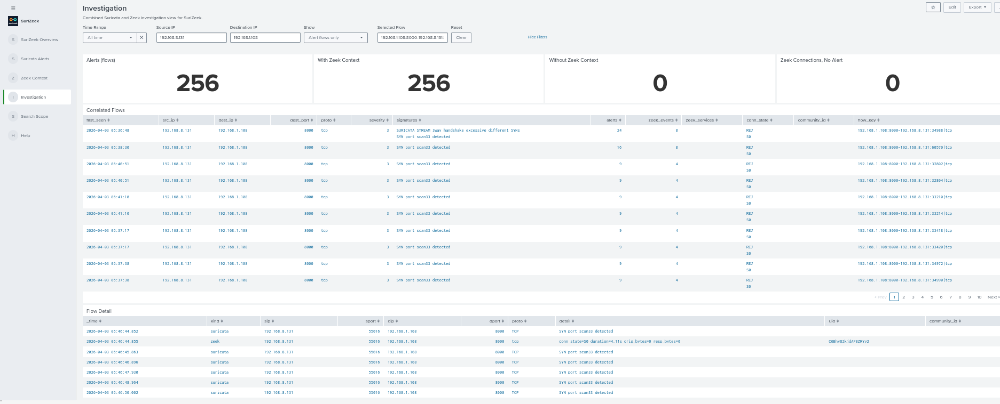
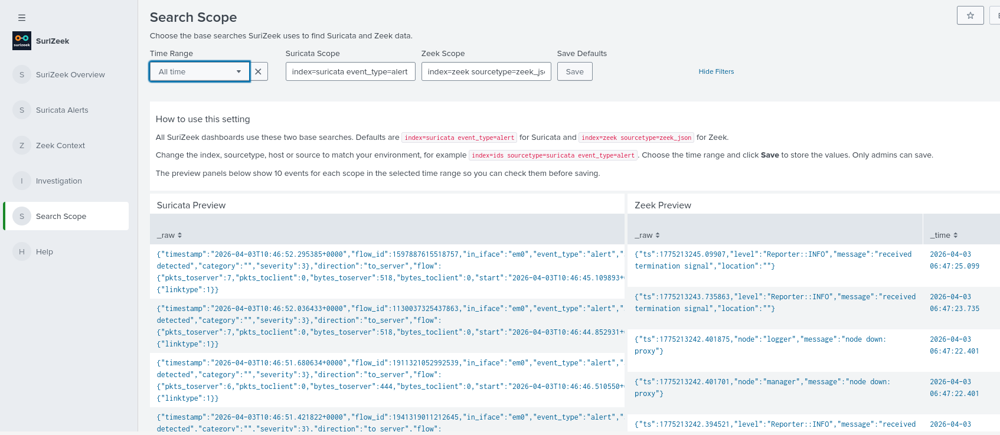

# SuriZeek for Splunk

SuriZeek is a Splunk app that correlates Suricata alerts with Zeek network logs. It provides dashboards for overview, Suricata alerts, Zeek context, and a combined investigation view that shows the Zeek connection behind each alert.

<!-- Splunkbase app page:
https://splunkbase.splunk.com/

This repository is a usage guide for the app. It is intended for analysts and Splunk administrators who want to install, configure, and operate the app. -->

---

## 📌 What the App Does

- Summarises Suricata alerts and Zeek activity in one place.
- Correlates each Suricata alert with the Zeek connection of the same flow.
- Shows alerts with and without Zeek context, and Zeek connections that have no alert.
- Shows flow details from Zeek `conn`, `dns`, `http`, and `ssl` logs.
- Calculates a priority score (critical, high, medium, low) from alert severity and scan signatures.
- Lets you click an IP or a flow to open it in the Investigation dashboard.
- Uses `community_id` when it is present in the data.

---

## 🚀 Splunkbase

Install the app from Splunkbase, then open it from the Splunk App Launcher:

```text
SuriZeek
```

---

## ✅ Required Data

The app expects Suricata and Zeek data to already be indexed and searchable in Splunk.

> ℹ️ Note: This app does not collect or ingest logs. It analyses data that is already available in Splunk.

Default search scopes:

```text
Suricata: index=suricata event_type=alert
Zeek:     index=zeek sourcetype=zeek_json
```

Suricata fields used: `event_type`, `src_ip`, `dest_ip`, `src_port`, `dest_port`, `proto`, `alert.signature`, `alert.severity`.

Zeek fields used: `uid`, `id.orig_h`, `id.orig_p`, `id.resp_h`, `id.resp_p`, `proto`, `service`, `conn_state`.

Zeek logs must be JSON with one event per line. If Splunk groups several Zeek events into one, the TA below fixes the parsing and sets the `zeek_json` sourcetype automatically:

https://splunkbase.splunk.com/app/8598

> 💡 Tip: Start by opening the Search Scope dashboard. If both previews return events, the other dashboards are much more likely to work as expected.

---

## 📊 Dashboard Guide

### SuriZeek Overview

Use this dashboard for the first high-level review. It shows the priority distribution, top Zeek services, top Suricata signatures, and source IPs seen in both Suricata and Zeek.

Screenshot:



### Suricata Alerts

Use this dashboard to review Suricata alerts over time, top signatures, top source IPs, severity, and categories.

Screenshot:



### Zeek Context

Use this dashboard to review Zeek connections: top source and destination IPs, services, protocols, connection states, and weird activity.

Screenshot:



### Investigation

Use this dashboard to correlate alerts with Zeek connections.

- **Time Range**: the period to search.
- **Source IP / Destination IP**: filter the flows by address.
- **Show**: choose alert flows only, or include Zeek connections without alerts.
- **Selected Flow**: the flow shown in the Flow Detail panel. Click a row in Correlated Flows to set it.
- **Clear**: clears the selected flow and both IPs. Time Range is kept.

The four tiles show alert flows, flows with Zeek context, flows without Zeek context, and Zeek connections with no alert.

Tiles and tables:

- **Alerts (flows)**: connections that have Suricata alerts.
- **With Zeek Context**: alert connections that also have Zeek events.
- **Without Zeek Context**: alert connections with no Zeek event. Check the Zeek sensor coverage for these.
- **Zeek Connections, No Alert**: Zeek connections that Suricata did not alert on.
- **Correlated Flows**: one row per connection, with `alerts` (Suricata alert count), `zeek_events` (Zeek event count), `zeek_services`, `conn_state` and `flow_key` (the key that matches alerts to Zeek events). Click a row to open Flow Detail.
- **Flow Detail**: every Suricata and Zeek event of the selected connection in time order (connection state and bytes, DNS query, HTTP request, TLS server name).

The tiles do not change with the Show setting. Source IP and Destination IP match the address anywhere in the event, as source or destination.

Screenshot:



### Search Scope

Use this dashboard to set the two base searches and the default time range used by all dashboards.

Screenshot:



### Help

Short usage notes inside the app, plus contact details.

---

## 🧭 Search Scope and Time Range

Settings are saved in a lookup:

```text
surizeek_settings.csv
```

To change them:

1. Open the Search Scope dashboard.
2. Edit the Suricata Scope and the Zeek Scope.
3. Choose the Time Range.
4. Click Save.

Examples:

```text
index=ids sourcetype=suricata event_type=alert
index=zeek source=*conn.log
```

Only admins can save. The preview panels show 10 events for each scope so you can check them before saving.

> 💡 Tip: If your data is older than the default time range, choose All time before saving.

---

## 👆 Click-through

- **Overview**, Top Shared Source IPs: click an IP to open Investigation for that IP.
- **Suricata Alerts**, Top Source IPs and Potential Scanners: click a row to open Zeek Context for that IP.
- **Suricata Alerts**, Recent Alerts: click a row to open its flow in Investigation.
- **Investigation**, Correlated Flows: click a row to open Flow Detail.

---

## 🔗 How Correlation Works

Each event is turned into a flow key made of both endpoints (`IP:port`, sorted) and the protocol. A Suricata alert and a Zeek connection with the same key belong to the same flow.

- ICMP ignores ports.
- Zeek events without `proto` are treated as TCP.
- If `community_id` exists in both sources, it is shown in the tables.

---

## ✅ Recommended Workflow

1. Install the app from Splunkbase.
2. Open Search Scope and confirm both previews return events.
3. Choose the time range and click Save.
4. Review the Overview dashboard.
5. Open Suricata Alerts and click a source IP.
6. In Investigation, click a flow row to see the Flow Detail.
7. Use Clear to start a new investigation.

---

## 🔎 Troubleshooting

### Dashboards are empty

Check the Search Scope and Time Range. Make sure both scopes match where your data is stored.

### Zeek panels are empty

Check that the Zeek events are JSON, one event per line, and that the Zeek Scope matches (for example `sourcetype=zeek_json`).

### No Zeek context for alerts

Make sure Zeek logs cover the same period and the same network segment as the Suricata alerts.

### Flow Detail is empty

Click a row in Correlated Flows first. The panel shows only the selected flow.

---

## 📌 Known Notes

- This app does not ingest logs by itself.
- Suricata and Zeek data must already be indexed and searchable in Splunk.
- Flow details are shown for Zeek `conn`, `dns`, `http`, and `ssl` logs.

---

## 🤝 Support

Developer: Kaled Aljebur

Email:

```text
kaledaljebur@gmail.com
```

LinkedIn: https://www.linkedin.com/in/kaled-aljebur/

Contact me if you need a customised version of this app or a custom Splunk app for your environment.
